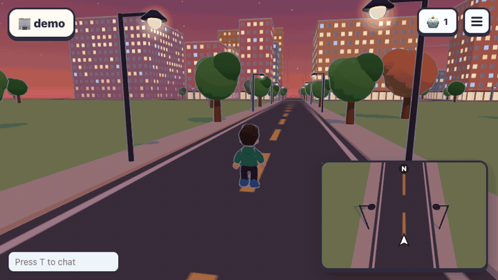
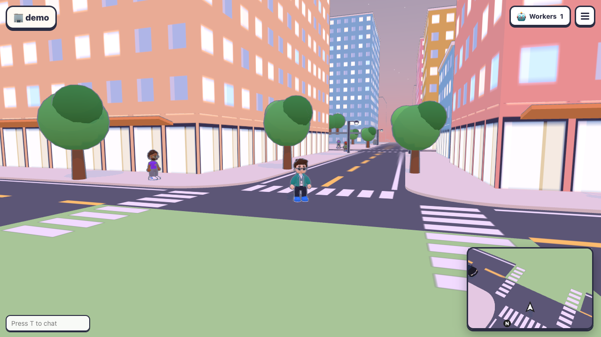
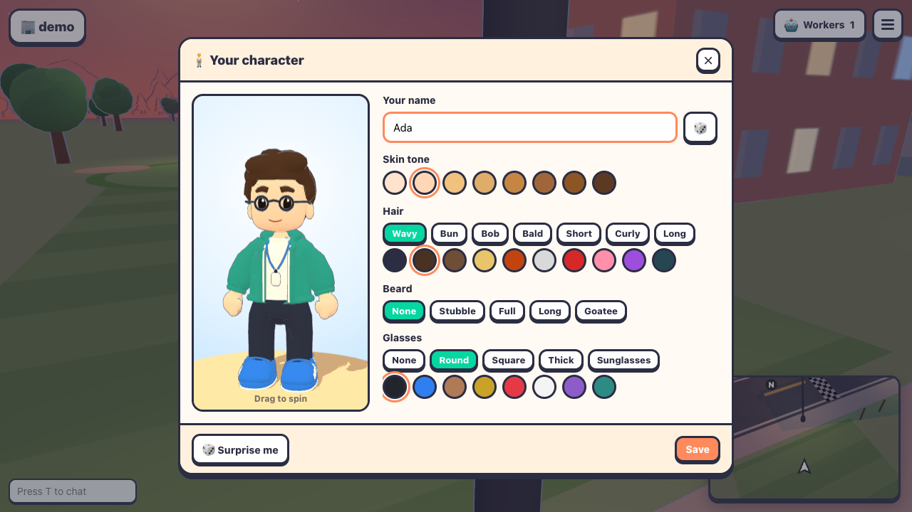
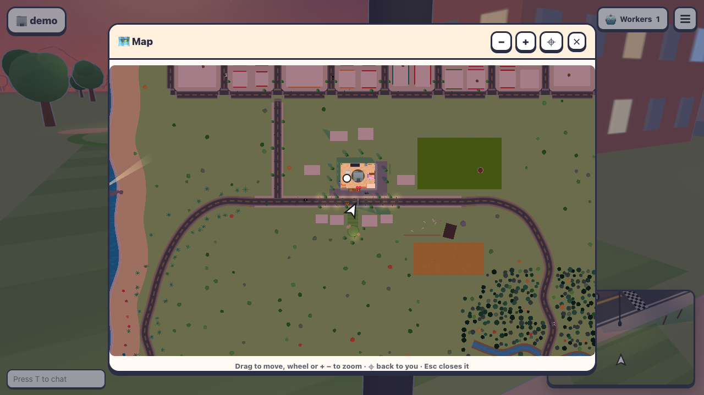
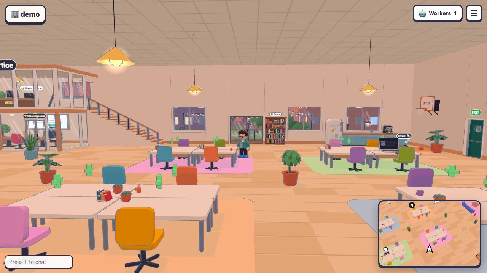

<div align="center">

# 🚀 Command Express

### O escritório de agentes de IA, numa cidade 3D viva

**Contrate Claude Code, Codex, OpenCode, Grok, Cursor e outros como colegas de trabalho em mesas, acompanhe o terminal de cada um ao vivo e comande seu time de agentes de programação andando por um escritório em desenho animado.** Cada repositório do GitHub é um andar do prédio, e lá fora a cidade continua.

[](LICENSE)
[](#rodar-no-seu-computador)
[](README.md)

[**Rodar no seu computador**](#rodar-no-seu-computador) · [**Novidades**](#o-que-tem-de-novo) · [**Controles**](#controles) · [**Read in English**](README.md)



</div>

> **Feito a partir do [Agent Office](https://github.com/AgentSystemLabs/agent-office)**, da AgentSystemLabs (licença MIT): o escritório 3D que o seu time divide com os agentes de programação. O Command Express vai além: uma cidade inteira em volta do escritório, personagens novos, mapa de verdade, música e muito mais, tudo em português. Obrigado aos autores e colaboradores do Agent Office pela base.

---

## O que tem de novo

| | |
| --- | --- |
|  | **Uma cidade pra andar e dirigir.** Depois do escritório a cidade continua, no mesmo estilo da rua: avenidas com faixa de pedestre e calçadas de quina arredondada, quarteirões coloridos com lojas e toldos, os arranha-céus do centro no horizonte, táxis e viaturas rodando nos quarteirões e gente andando nas calçadas. Dá pra entrar de carro pela rua da frente. |
|  | **Avatares feitos no Blender.** Um funcionário de escritório estilo chibi, com esqueleto completo e expressões (pisca, mexe a boca quando fala), e um editor de personagem: 7 cortes de cabelo, barbas, óculos (escuros também), moletons, jaquetas, suéter, camiseta estampada, crachá com cordão, cada cor do seu jeito. Todo mundo te vê como você escolheu. Mãos que gesticulam (tchau, joinha, apontar, palmas) em primeira e terceira pessoa. |
|  | **Mapa estilo GTA.** O minimapa gira com você; a tecla **J** abre o mapa grande: a planta do andar quando você está dentro, o mundo todo quando está na rua. Arraste, dê zoom com a rodinha ou com pinça, e ⌖ volta pra você. |
|  | **E mais.** Jukebox que toca YouTube (link, playlist, mix e busca) com som ambiente pelo andar; modo maquete; iluminação toon suave e coerente dentro e fora do prédio; carros de verdade com rodas girando; vista mais limpa da cidade; e a interface inteira em **português do Brasil** e em **coreano** (escolha em ⚙️ Configurações). |

Tudo o que o Agent Office faz continua aqui: um andar por repositório, workers nas mesas, terminais ao vivo compartilhados, voz e chat, issues e PRs do GitHub nas paredes, agentes que gerenciam agentes, a visão 2D pro celular, os mapas do castelo e da estação espacial, o bar no terraço…

## Rodar no seu computador

Você precisa de **Node.js 20+**, **git**, o **GitHub CLI** (`gh auth login`) e pelo menos um agente instalado e logado (por exemplo `claude`).

```bash
git clone https://github.com/muguetdev/command-express && cd command-express
npm install          # também compila o cliente e o servidor
npm install -g .     # coloca o comando `agent-office` no seu PATH
AGENT_OFFICE_LANG=pt-BR agent-office
```

Na primeira vez ele te guia pelo terminal: a pasta dos projetos, o login no GitHub e o primeiro projeto. Depois abre o escritório no navegador, já logado. Vá até uma mesa vazia, aperte **E** e contrate um worker.

Pra colocar num servidor e dividir com o time (AWS, Azure, Railway, Fly.io, Dokploy, Coolify ou qualquer Ubuntu/Debian), veja as instruções no [README em inglês](README.md#deploy-to-aws-ec2).

## Controles

| Tecla | O que faz |
| --- | --- |
| W A S D | Andar (Shift pra correr) |
| Espaço | Pular |
| E | Interagir: contratar um worker, abrir o terminal, ler um quadro, sentar, chamar o elevador |
| N | Ir até o próximo worker que está esperando por você |
| J | O mapa grande |
| 1–6 | Emotes: tchau, joinha, palmas, dança, apontar, facepalm |
| T / Enter | Chat |
| V | Entrar na voz; depois segure V pra falar |
| Tab | O menu ☰ com todas as janelas |
| Esc | Fecha qualquer janela |

A lista completa está em [docs/controls.md](docs/controls.md).

## Créditos

O Command Express é feito a partir do [Agent Office](https://github.com/AgentSystemLabs/agent-office), da AgentSystemLabs e seus colaboradores. Os carros são os modelos low-poly CC0 do Quaternius; o avatar do escritório (`blender/avatar`) foi feito para o Command Express.

## Licença

[MIT](LICENSE), a mesma do Agent Office: o aviso de copyright original foi mantido, junto com o do Command Express.
